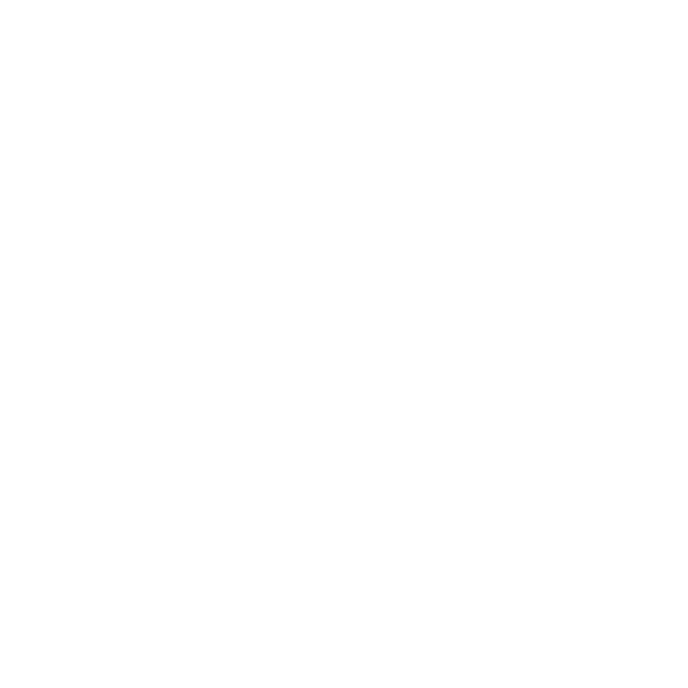

<p align="center">
  <a href="" rel="noopener">
 </a>
</p>

<h1 align="center">Vector JS</h1>

<div align="center">

</div>

---

<p align="center"> Provides vector operations and conversions for Minecraft Bedrock scripting (although it should work for anything).
    <br> 
</p>

## 🏁 Getting Started <a name = "getting_started"></a>

Copy Vector.js into your Scripts folder (bp/scripts) and put ```import { vec3 } from 'scripts/Vector.js';``` at the top of your script

### Code examples

Creating and adding two vectors
```
let a = vec3(1,2,3);
let b = vec3(4,5,6);
b = a.add(b);
console.log(b);
```

Making a 10 unit long 2d vector
```
let a = vec2(1,2);
console.log((a.normalized).multiply(10));
```

Getting the normal of a triangle
```
let a = vec3(1,3,0);
let b = vec3(4,5,2);
let c = vec3(2,-5,6);
let normal = a.subtract(c).cross(b.subtract(c)).normalized;
```

## ✍️ Authors <a name = "authors"></a>

- [@BigChungus21220](https://github.com/BigChungus21220)
